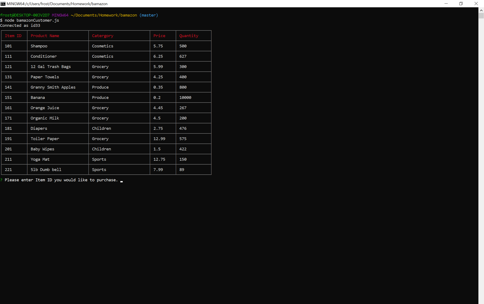
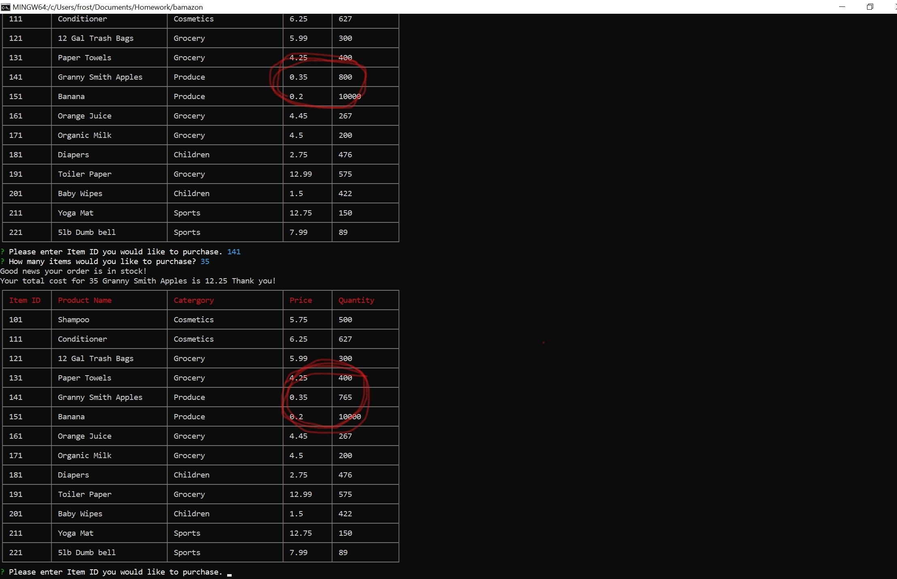
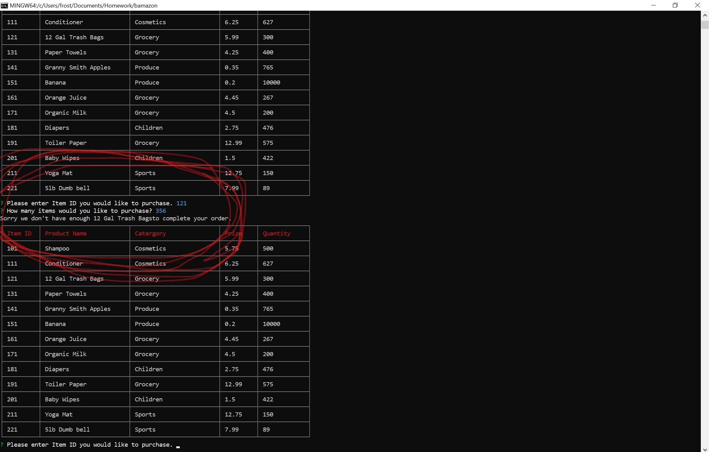

#BAMAZON

**This is an Amazon-like storefront with the MySQL skills i've learned this week. The app will take in orders from customers and deplete stock from the store's inventory.** 

**What can it do?**

`node bamazonCustomer.js`

This will display the information stored in the database and begin your order.

**Ordering something**

Ordering something is as easy as choosing the Item ID that you want.

**Completing the order**

Once you have chosen the item you want enter the quantity you need and press enter. The database will dynamically update the quantities based on how many you ordered.

**Out of StocK**

If you try and order too many of something you will get an error let you know that there isnt enough stock to complete the order.

